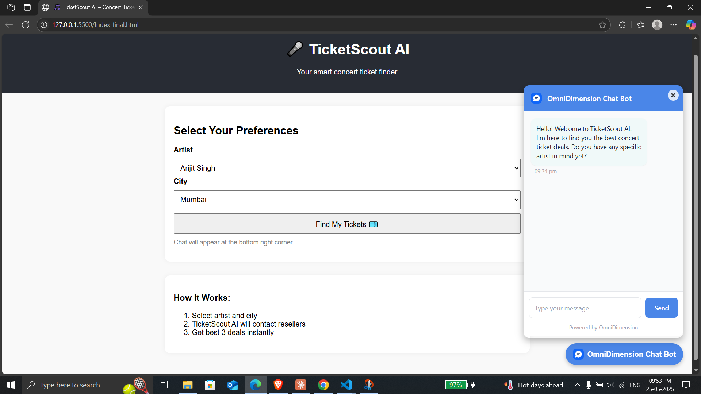

# 🎵 TicketScout AI – Concert Ticket Voice Assistant

**TicketScout AI** is an intelligent voice agent powered by OmniDimension that helps users find the best concert ticket deals by calling multiple resellers, comparing offers, and recommending the best 3 options – all via voice!

---

## 🚀 Features

- 🧠 Voice agent built using **OmniDimension**
- 🔎 Compares ticket prices from multiple **resellers**
- 📊 Uses **Google Sheets** to manage:
  - Reseller Data
  - Call Logs
  - Email Templates
- ✉️ Sends deal summary via **Email**
- 🌐 Simple web interface for users

---

## 🎯 Supported Artists

- Arijit Singh  
- Karan Aujla  
- Diljit Dosanjh  
- A.R. Rahman  
- Amit Trivedi

---

## 🛠 Tech Stack

| Component         | Tool Used         |
|------------------|-------------------|
| Voice Agent       | OmniDimension     |
| Data Storage      | Google Sheets     |
| Email Automation  | Gmail API / SMTP  |
| Web UI            | HTML, JS, CSS     |

---

## 💻 How It Works

1. **User selects artist + city** on web interface  
2. Voice agent gathers preferences (budget, seats, etc.)  
3. Calls multiple resellers via OmniDimension  
4. Logs responses to **Google Sheets**  
5. Recommends **Top 3 deals**  
6. Sends summary email to the user

---

## 📂 Project Structure

```
📁 TicketScout-AI/
├── index.html               # Web interface with Omni bot
├── README.md                # Project documentation
├── /assets/logo.png         # Project logo
├── /scripts/                # (Optional) Sheets or webhook scripts
└── Ticket_data.xlsx # Sample data file
```

---

## 🧪 Testing Instructions

1. Clone or download this repo
2. Open `index.html` in your browser
3. Use dropdowns to pick artist & city
4. Chatbot will respond via OmniDimension
5. Logs update in connected Google Sheet

---

## 🔐 Omni Bot Script

```html
<script id="omnidimension-web-widget" async 
  src="https://backend.omnidim.io/web_widget.js?secret_key=YOUR_SECRET_KEY">
</script>
```

Replace `YOUR_SECRET_KEY` with your bot’s key.

---





## 📬 Contact

For queries, email: `inder26112004@gmail.com`  
